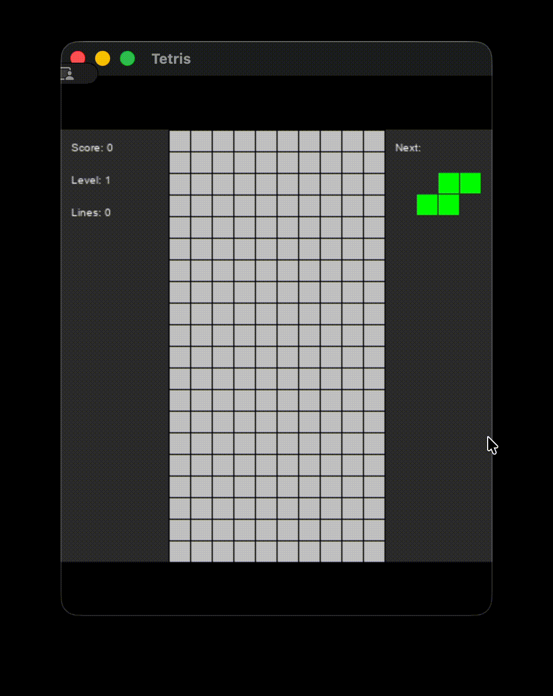

# 🎮 Tetris Game

A modern, feature-rich implementation of the classic Tetris game built with Python and Pygame.

<a href="preview.gif"></a>

<!-- Change width="480" to the desired pixel width (or remove it and use CSS) -->

## ✨ Features

- **Classic Tetris Gameplay**: All 7 standard tetromino pieces with authentic rotation mechanics
- **Smooth Controls**: Responsive movement with continuous key holding support
- **Modern UI**: Clean, resizable interface with score tracking and next piece preview
- **Progressive Difficulty**: Level system with increasing speed and scoring
- **Line Clearing**: Full row detection and clearing with combo bonuses
- **Game Over Detection**: Smart collision detection and restart functionality

## 🕹️ Controls

| Key       | Action                                               |
| --------- | ---------------------------------------------------- |
| `←` / `→` | Move piece left/right (hold for continuous movement) |
| `↓`       | Soft drop (hold for faster falling)                  |
| `↑`       | Rotate piece clockwise                               |
| `Space`   | Hard drop (instant drop to bottom)                   |
| `Any Key` | Restart game (when game over)                        |

## 🚀 Getting Started

### Prerequisites

- Python 3.7 or higher
- Pygame library

### Installation

1. Clone this repository:

```bash
git clone https://github.com/yourusername/tetris.git
cd tetris
```

2. Install the required dependencies:

```bash
pip install pygame
```

3. Run the game:

```bash
python main.py
```

## 🎯 Game Rules

- **Objective**: Clear horizontal lines by filling them completely with tetromino pieces
- **Scoring**:
  - 100 points per cleared line
  - Bonus points for combo clears (multiple lines at once)
  - 1000 bonus points for each level advancement
- **Levels**: Advance every 10 lines cleared, increasing game speed
- **Game Over**: When pieces reach the top of the playing field

## 🏗️ Technical Features

### Architecture

- **Object-Oriented Design**: Clean separation of game logic and rendering
- **Modular Structure**: Easy to extend and modify
- **Efficient Collision Detection**: Fast and accurate piece placement validation

### Key Components

- `Tetromino` class: Handles piece shapes, rotations, and positioning
- `Tetris` class: Main game engine with state management
- Configurable tetromino shapes and colors
- Responsive display scaling for different window sizes

### Performance Optimizations

- 60 FPS rendering with efficient screen updates
- Minimal computational overhead for smooth gameplay
- Memory-efficient grid representation

## 🎨 Customization

The game is highly customizable through the `TETROMINO_INFO` configuration:

```python
# Easy to modify colors and shapes
TETROMINO_INFO = [
    {
        'shapes': [['..00.', '..00.']],
        'color': (255, 255, 0)  # Yellow square
    },
    # Add your own tetromino designs!
]
```

## 🔧 Development

### Code Structure

```
.
├── main.py              # Main game file
├── README.md            # This file
├── preview.gif          # Game preview
├── pyrightconfig.toml   # Type checking configuration
└── assets/
    └── sounds/
        ├── bg.mp3
        ├── bwah.wav
        ├── fail.wav
        └── hit1.wav
```

### Key Classes and Methods

- `Tetromino.__init__()`: Initialize piece with shape and color
- `Tetromino.rotate()`: Handle piece rotation
- `Tetris.valid_move()`: Collision detection
- `Tetris.lock_piece()`: Place piece on grid
- `Tetris.update()`: Main game loop logic

## 🤝 Contributing

Contributions are welcome! Here are some areas for potential improvement:

- [ ] Implement different game modes (endless, sprint, etc.)
- [ ] Add particle effects for line clears
- [ ] Create AI opponent or demo mode
- [ ] Add save/load high scores
- [ ] Implement ghost piece preview
- [ ] Add customizable key bindings

### How to Contribute

1. Fork the repository
2. Create a feature branch (`git checkout -b feature/amazing-feature`)
3. Commit your changes (`git commit -m 'Add some amazing feature'`)
4. Push to the branch (`git push origin feature/amazing-feature`)
5. Open a Pull Request

## 📝 License

This project is licensed under the MIT License - see the [LICENSE](LICENSE) file for details.

## 🙏 Acknowledgments

- Original Tetris game concept by Alexey Pajitnov
- Built with [Pygame](https://www.pygame.org/) - Python game development library
- Inspired by classic arcade gaming experiences

## 📊 Stats

- **Lines of Code**: ~400
- **Language**: Python 3
- **Framework**: Pygame
- **Type Hints**: Fully typed for better development experience
- **Performance**: 60 FPS target with minimal CPU usage

---

**Enjoy playing! 🎮** If you like this project, please give it a ⭐ on GitHub!
